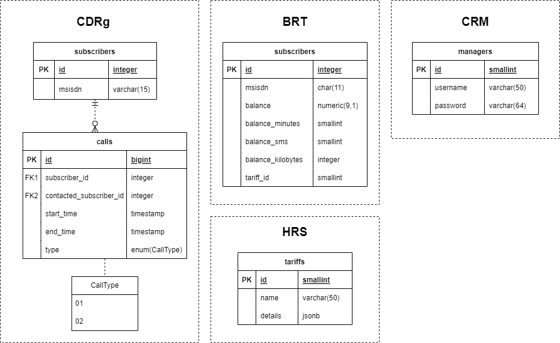

# Структура базы данных

## Физическая модель базы данных

## Описание структуры

Каждый из микросервисов имеет собственную базу данных согласно своей зоне ответственности. Таким образом, проект содержит 4 базы данных:
- CDRg;
- BRT;
- HRS;
- CRM.

### CDRg

База данных сервиса “Генератор CDR”, содержащая информацию об абонентах и их звонках, генерируемых самим сервисом. Таблицы и их описание расположены в раскрывающихся элементах:

subscribers

Хранит номера телефонов абонентов. Выбранный тип данных для MSISDN обусловлен тем фактом, что звонки могут совершаться не только с российских номеров, при этом максимальная длина телефонного номера составляет 15 цифр.

calls

Хранит информацию о звонках абонентов. Тип данных bigint для первичного ключа обусловлен бизнес-логикой процесса (звонков может быть много - гораздо больше, чем абонентов). 

Атрибут “type” представляет собой enum из двух значений: ‘01’ и ‘02’ (исходящий и входящий вызовы соответственно).

### BRT
Содержит информацию об абонентах оператора “Ромашка”. 

subscribers

Для атрибута msisdn здесь был выбран тип данных char(11) исходя из предположения, что оператор обслуживает российские номера, содержащие 11 цифр.

Помимо атрибутов balance и balance_minutes, необходимых для выполнения задания, были добавлены также атрибуты balance_sms и balance_kilobytes, чтобы обеспечить расширяемость системы.  

### HRS
Содержит информацию о тарифах оператора “Ромашка”.

tariffs

Поскольку необходимо было обеспечить возможность в будущем добавлять тарифы с новыми условиями, не прибегая к модификации базы данных, при проектировании выбор стоял между типом данных jsonb, поддерживаемым PostgreSQL, и подходом EAV (entity-attribute-value). Решено было остановиться на первом варианте, поскольку:
- данный формат занимает меньше места;
- упрощается чтение схемы;
- как правило, запросы выполняются быстрее, чем с EAV (хоть и не всегда).

Примерное содержание таблицы:

### CRM

База данных микросервиса CRM, в которой содержатся данные для аутентификации пользователя с ролью “Менеджер”. По-хорошему эта информация должна храниться в отдельном микросервисе для аутентификации и авторизации, но было принято решение оставить эти данные здесь во избежание усложнения системы в целом. 

Ещё одно замечание: в БД не хранится информация об абонентах, поскольку им предоставляется доступ к сервису только по номеру телефона. Таким образом, для предоставления прав абоненту необходимо убедиться, что его номер присутствует в BRT. 

managers

