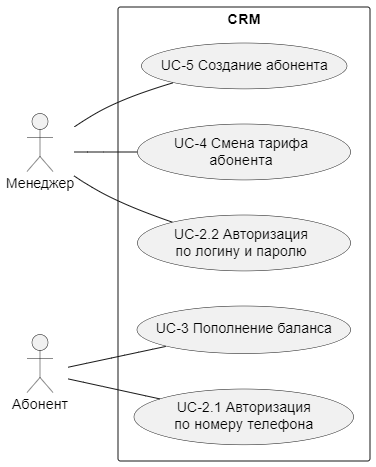

# Описание микросервисов

В разделе представлены важные моменты из практических заданий на аналитику и разработку, а также уточнения и допущения менторов из Telegram-чата. определены зоны ответственности микросервисов, в т.ч. в формате диаграммы вариантов использования (для CRM).

---

## CDRg

- **Зона ответственности**:
    - генерирует данные;
    - собирает CDR;
    - отправляет CDR в BRT на тарификацию.
- Локальная БД должна содержать список абонентов (минимум 10). 
- Звонки абонентов фиксируются в **CDR**:
    - 1 CDR = 10 записей;
    - формат txt (разделитель данных - запятая, разделитель записи - перенос строки);
    - каждая запись содержит:
        - тип вызова (01 - исходящий, 02 - входящий);
        - телефонный номер обслуживаемого абонента;
        - телефонный номер абонента, с которым осуществлялась связь;
        - дата и время начала звонка (Unix time);
        - дата и время окончания звонка.
    - записи должны идти в хронологическом порядке;
    - записи могут генерироваться параллельно (= реализовать многопоточность);
    - количество и длительность звонков определяются случайным образом;
    - записи генерируются в рамках одного года;
    - если генерируется исходящий звонок от абонента, то должен генерироваться и соответствующий входящий вызов для абонента, с которым осуществлялась связь;
    - пример записей в CDR: 

    ```
        02,79876543221, 79123456789, 1709798657, 1709799601
        01,79996667755, 79876543221, 1709899870, 1709905806
    ```

---

## BRT

- **Зона ответственности**: 
    - выбор из CDR данных абонентов, обслуживаемых оператором “Ромашка”;
    - ежемесячное списание абонентской платы у абонентов с помесячным тарифом при получении CDR за следующий месяц (прим.: плата за апрель списывается в мае);
    - преобразование записи из CDR посредством дополнения идентификатором тарифа;
    - отправка запроса на вычисление суммы списания в HRS;
    - списание средств со счета абонента в соответствии с ответом от HRS;
    - обработка запроса на смену тарифа;
    - обработка запроса на создание абонента.
    - автоматическое пополнение баланса и смена тарифов для абонентов раз в месяц:
        - каждый абонент пополняет свой баланс на случайную сумму; 
        - от 1 до 3 абонентов меняют свой тариф. 
- В БД хранятся данные об абонентах оператора “Ромашка”: msisdn, баланс, идентификатор тарифа.
- Если на счете не хватает средств, баланс уходит в минус. 

---

## HRS

- **Зона ответственности**:
    - расчет длительности вызова;
    - расчет суммы списания, в т.ч. определение абонентской платы;
    - отправка информации о сумме списания в BRT. 
- В БД хранятся данные о тарифах (структура БД должна позволять добавлять новые тарифы без рефакторинга).
- Длительность вызова округляется в большую сторону.
- Сумма списания округляется до десятых (минимальный шаг баланса 0.1 у.е.).
- Тарифы “на старте”:
    

---

## CRM

- **Зона ответственности**: 
    - авторизация абонентов и менеджеров;
    - отправка запросов в BRT:
        - на идентификацию абонентов;
        - на создание новых абонентов;
        - на пополнение баланса абонентов;
        - на смену тарифа абонентов.
- 2 роли:
    - функции абонента: авторизация по номеру телефона, пополнение счета; 
    - функции менеджера: авторизация по логину и паролю, смена тарифа абонента, создание нового абонента (баланс по умолчанию - 100 у.е.)
      
    
  
- Диаграмма вариантов использования сервиса:
  
    

